# Ludo Game
Ludo is a board game that most people have played as a child. On this website you can now play Ludo on your phone or computer. As a user, you also get the choice to be 2-4 players. The aim of the game is to move your pieces from your home to the nest that is in the centre of the board. To get to the centre of the board, players must move around the entire board without being knocked back to their home by their opponents. View the live site [here](https://ko11e.github.io/Ludo-Game/).

PIC MOCKUP

## Features 
### Existing Features
The site is responsive to all screens and can also be played on a mobile.
#### Favicon
  - The website's favicon features four game pieces in red, green , yellow and blue since that are the main colors of the game.
  - By adding a favicon , users can easily identify the tab among multiple tabs open.

#### Home page/Start page

#### Board

#### Players

#### The Footer 

### Features Left to Implement
- The number of Players the is choosen in the index page will change the dislpay of the gamebord. As it is now the pawn from the non selected player gets remove from the field but the field are the same.
- If not all the 4 players are selected the user can select if the remaining player sould be played bye the computer.
- The user can click and drag the pawn instead of just clicking.
- When hoovering over the pawn it displays the squer it will land on

## Design
### Wireframe
#### Desktop
##### Homepage

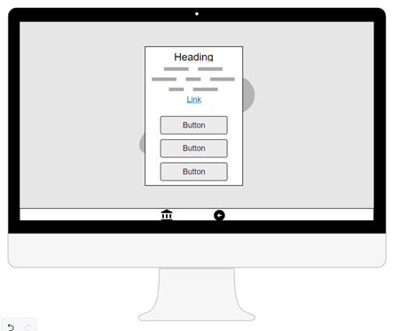
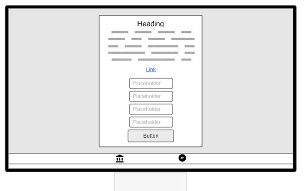

##### Boardgame page
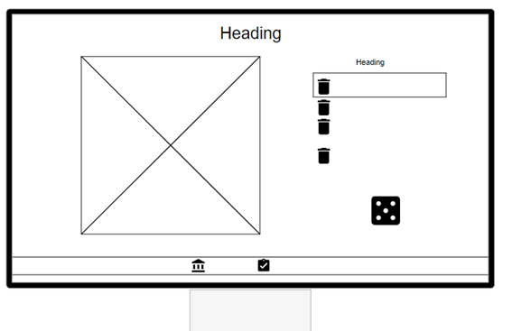

#### Mobile
##### Homepage

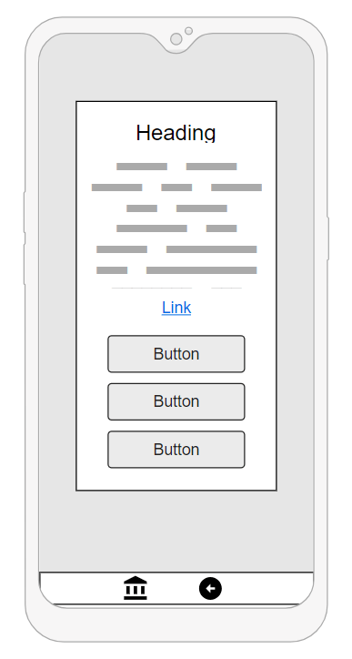
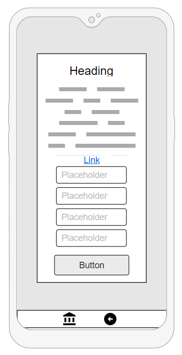

##### Boardgame page
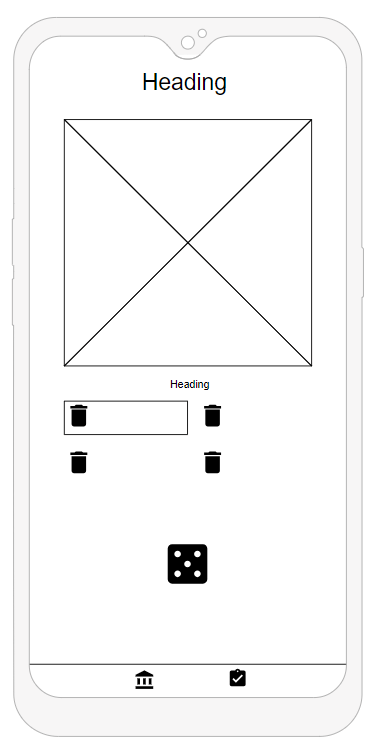

### Color/Images
 

## Technologies

- **HTML**  
 The structure of the Website was developed using HTML as the main language.
- **CSS**  
The website's styling was achieved through the use  CSS, which is located in an external file.
- **Javascript**  
The website was made interactive by using Javascript. 
- **Gitpod**  
The website was created by using Gitpod.
- **GitHub**  
The source code is hosted on GitHub and deployed using Git Pages.
- **Git**  
During the development of the website, Git was utilized to commit and push code.
- **Font Awesome**  
Icons from https://fontawesome.com/ are used as Home, restart and rulse icons in the footer.
- **Tinyjpg**  
Used https://tinyjpg.com/ to compress the size of the images.
- **[Favicon.io](https://favicon.io/favicon-converter/)**  
Favicon files were made at favicon.io
- **[balsamiq](https://balsamiq.com/wireframes/desktop/#)**  
Used balsamiq to create the wireframes.
- **[Photopea:](https://www.photopea.com/)** 
This was used creat the favicon and the pawns for the game.

## Testing
### Manual Test
In this section, the tests that have occurred will be explained. The first part explains what is expected to occur and how the test has been performed. The other part describes what happens under the test. 
#### Start page
##### Select the number of players
The start page of the game allows the user to choose the number of players, whether it's two, three, or four. Once the number of players is selected, the buttons should disappear and the corresponding number of input text-boxes should appear. Additionally, a new button should appear that signals the start of the game. This was tested by clicking on the three different buttons and seeing the response.
###### What occur
The website functioned as intended and did not display any error messages.

##### Name entered
When entering the name in the input text-boxes and clicking on "Start the game" the names should follow with to the boargame page. If a name isn't entered Player and the number of the player are entered as default. It was tested for two, three, and four players where all boxes were entered, where some and no boxes were filled.
###### What occur
The website functioned as intended and did not display any error messages. However, if the user enters a space that will be the entered name.

##### Game Rules
Testing the performers on the model that should appear when you click on "Rules for Ludo". When the user clicks on the button "Rules to Ludo" a model appears in the middle of the screen. This has been tested at different times both when buttons for the number of players are displayed and when the input boxes are displayed. 
###### What occur
The website functioned as intended and did not display any error messages.

#### Footer
The Font Awesome icons in the footer were tested to ensure that they each open the home/start page and have a hover effect with a black border around the icon. This has been tested at different times both when buttons for the number of players are displayed and when the input boxes are displayed. 
###### What occur
As expected, each item goes back to the home page when clicked, and the correct hover border appears when the user hovers over the icon.

#### Boardgame page
##### Rolling dice
To roll the die the user/users click on the dice icon that is placed under the text "Roll dice". When clicking on the dice a new dice will appear that chooses the number of steps the pawn can move. After a pawn has been selected and moved the dice will display the same icon as in the beginning. The dice should not change before a pawn has been selected except in the first round. This has been tested by clicking on the dice symbol at the beginning of the user's turn and after the die display the number of movements for the pawn.

##### Rolling dice in the first round
In the first round, all players have the opportunity to roll the die three times to get a one or a six. When the dice are rolled the numbers are displayed for 1.5 seconds and then change back to the icon that was in the beginning.

###### What occur
For both functions, the website functioned as expected and did not display any error message.

##### Movement on the first round
In the first round, all players have the opportunity to roll the die three times to get a one or a six. If a player receives a one or a six on the first or the second roll their turn is over and the next player will start their turn. When a player gets one or a six the code automatically moves the pawn with the number 1 the number shown on the die. The performance of this function has been tested with two, three, and four players.
###### What occur
The website functioned as intended and did not display any error messages or crashed.

##### Movement after the first round and a correct movement
After the die has been rolled the user can select the pawn that it what to move by clicking on the pawn on the board. When a pawn is selected the pawn will move the number of squares that are displayed on the die. The user should not be able to select its opponent's pawn. To test this performance a pawn on the field that is their own has been selected and tried to select the opponent's pawn as well.
###### What occur
The website functioned as intended and the selected pawn moved the number that was displayed on the die. When an opponent pawn was selected nothing happened which was expected. The website did not display any error messages or crashed.

##### Movement when a pawn is at home is selected
If the dice does show a one or a six the user is not able to move a pawn that is at the home. If a pawn is selected an alert message appears saying that the user is not able to select this pawn or any pawn that is in the home and is referred to select a pawn on the field. This alert message will appear every time you select a pawn in the home if you have pawns on the field. This was tested by repeatedly clicking on a pawn that was in the home even though a pawn was on the field. 
###### What occur
As expected the alert message appeared every time until the pawn on the field was selected. The website did not display any error messages or crashed.

##### Movement when all pawns are at the Homebase
If the dice doesn't show a one or a six the user is not able to move a pawn that is at the home. If all the pawns are at the home base the user needs to click one of the pawns and an alert message appears saying that this is the end of their turn because they are not able to move any of their pawns. After the user has clicked ok the turn is ended and the next player can roll the dice. This was tested by clicking on the pawns in the home base and on the opponent's pawns. When the user clicks on the opponent's pawn no alert message should appear.
###### What occur
The website functioned as intended and did not display any error messages.

##### Push an opponent pawn
When a user's pawn lands on the square that is already occupied by the opponent pawn is sent back to the opponent pawn to their home base. To test this several test games have been made with two, three, and four players. When a pawn is pushed it should appear on its homebaseplate as in the picture below.
###### What occur
The website functioned as intended and did not display any error messages.

##### Activplayer marker
On the website is a marker indicating what player has its turn. Every time a player's turn ends the marker is moved to the next player. At the end of the last player's turn, the marker is moved back to the first player. The performances of this have been tested by playing test games with two, three, and four players.
###### What occur
The website functioned as intended and did not display any error messages.

##### Pawn enters nest (Center of the board)
When a pawn enters the center of the field/nest the pawn disappears from the field. In the code, the pawn is also deleted from the pawns list and one is added til the value nests in the list. The performances of this have been tested by playing test games with two, three, and four players. Under the test games, the console logs the value of the nest and the pawnslist.
###### What occur
The website functioned as intended and did not display any error messages.

##### Winner
when a user enters all its pawns into the center of the board an alert message appears saying that they are the winner of the game and a trophy icon appears next to the winner. After a user has won the rest of the players have one more turn. If it's not the last player that wins, this is a bug that has not been fixed. To test this test games have been played to see this function.
###### What occur
The website functioned as intended and did not display any error messages.

##### Footer
The Font Awesome icons in the footer were tested to ensure that they open the home/start page or display the rules for 
Ludo as a model. The icon also has a hover effect with a black border around the icon. This has been tested at different times as in the beginning, the end, and the middle of the game. The home icon should return the user to the index.html and this will end the game. The clipboard displays the rules 
###### What occur
As expected, each item goes back to the home page when clicked, and the correct hover border appears when the user hovers over the icon.

### Accessibility
[Wave Accessibility](https://wave.webaim.org/) tool was used throughout development and for final testing of the deployed website to check for any aid accessibility testing.

Testing was focused to ensure the following criteria were met:

- All forms have associated labels or aria-labels so that this is read out on a screen reader to users who tab to form inputs
- Color contrasts meet a minimum ratio as specified in [WCAG 2.1 Contrast Guidelines](https://www.w3.org/WAI/WCAG21/Understanding/contrast-minimum.html)
- Heading levels are not missed or skipped to ensure the importance of content is relayed correctly to the end user
- All content is contained within landmarks to ensure ease of use for assistive technology, allowing the user to navigate by page regions
- All not textual content had alternative text or titles so descriptions are read out to screen readers
- HTML page lang attribute has been set
- Aria properties have been implemented correctly
- WCAG 2.1 Coding best practices being followed

### Validator Testing 
#### HTML 
No errors were returned when passing through the official W3C validator, se result below.
- Home/Start page 
  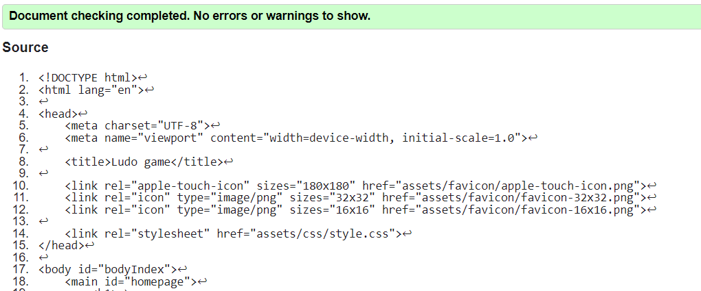
- Boardgame page 
  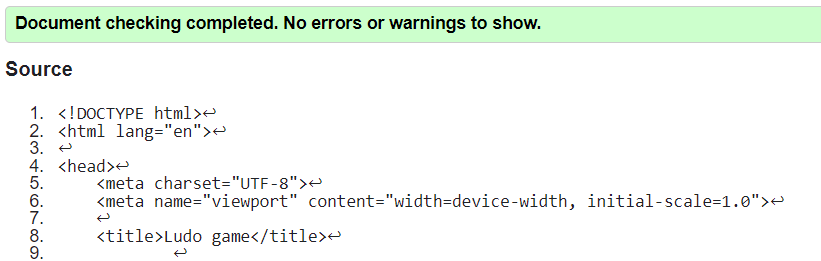
  
#### CSS  
No errors were found when passing through the official [(Jigsaw) validator]
  - CSS style file result 
  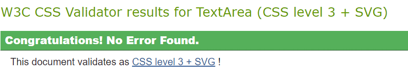

#### [JSHint Validation](https://jshint.com/) 
##### script.js
  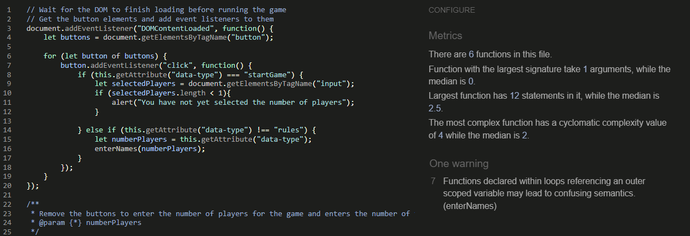
  
##### script_board.js
  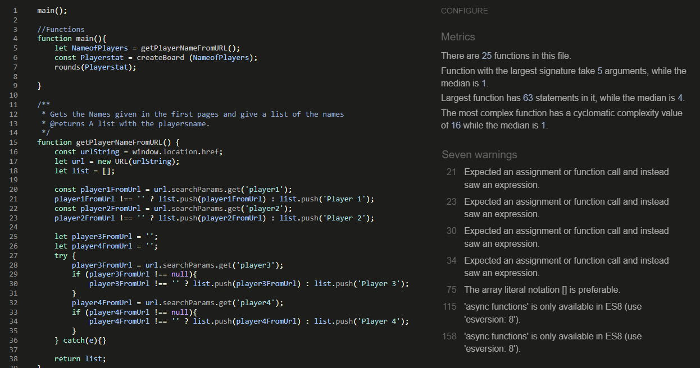

### Lighthouse testing

### Fixed Bugs
- when rolling a 6 the second roll wantn´t a 6 the player was able to select a pawn but it didnt move.
- when you roll two 6 after eachother the second time the selected moved 12 steps insted of 6.
- when a player had all is pawn in the nest the game didnt end.
- When a player last pawn enter the nest on a 6 the cod got stuck on the next line.

### Unfixed Bugs
- The user are able to push there own pawn of the field and back to the homebase.
- If any palyer but the last player is the winner the rest of the players still have one more turn. But if the winner is the last player the game ends.

## Deployment
The project was published on GitHub Pages by following these steps.
  1. Log in to GitHub and locate the [Repository](https://github.com/Ko11e/Ludo-Game.git)
  2. Click on "Settings", located at the end of the menu at the top of the page.
  3. Click on "Page", located in the middle of the menu on the left side.
  4. Under "Branch", click the drop-down called "None" and select "Main".
  5. Click "Save" and refresh the page.
  6. The link to the publish site will shown at the top of the page.

The live link can be found [here](https://ko11e.github.io/Ludo-Game/) 
 

## Credits 
- **Love math (Code Institute)** 
The first function in the Love math is taken to the first function to the start page. However, the code has been modified to fit this project.

- **[Atomic object](https://spin.atomicobject.com/css-responsive-square/)** 
To make the board game field and have it responsive-without the squers being disformed. The code found at the atomic object was used.

- **[Stockoverflow](https://stackoverflow.com/) and [W3schools](https://www.w3schools.com/)**  
The bugs that appear under the project were solved using Stockoverflow and W3schools.

### Content 
- The text for the rules is taken from the website [Yellow mountain imports](https://www.ymimports.com/).

### Media
 - The image for the background for the start page is taken from [Pexels](https://www.pexels.com/) 

### Acknowledgements 
- My family always listens to all my ideas and gives my feedback.
